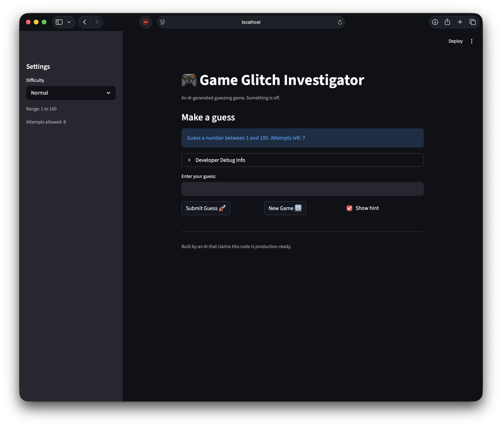
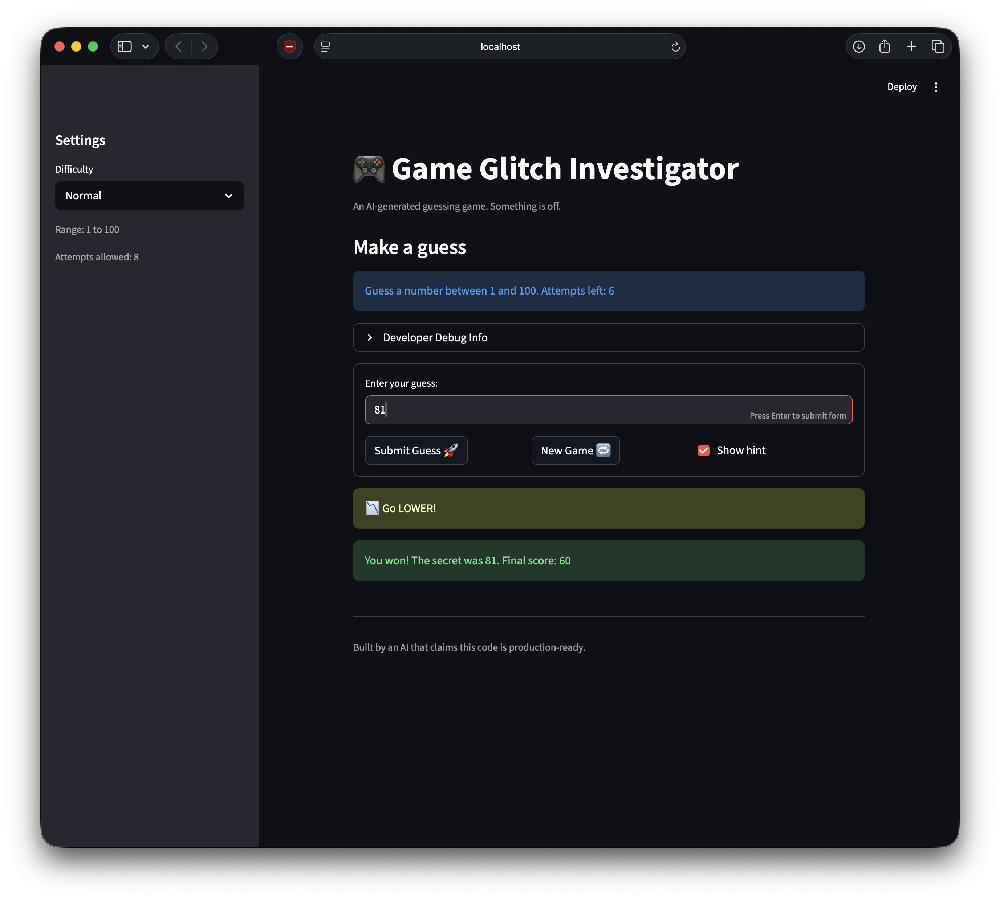

# 🎮 Game Glitch Investigator: The Impossible Guesser

## 🚨 The Situation

You asked an AI to build a simple "Number Guessing Game" using Streamlit.
It wrote the code, ran away, and now the game is unplayable.

- You can't win.
- The hints lie to you.
- The secret number seems to have commitment issues.

## 🛠️ Setup

1. Install dependencies: `pip install -r requirements.txt`
2. Run the broken app: `python -m streamlit run app.py`

## 🕵️‍♂️ Your Mission

1. **Play the game.** Open the "Developer Debug Info" tab in the app to see the secret number. Try to win.
2. **Find the State Bug.** Why does the secret number change every time you click "Submit"? Ask ChatGPT: _"How do I keep a variable from resetting in Streamlit when I click a button?"_
3. **Fix the Logic.** The hints ("Higher/Lower") are wrong. Fix them.
4. **Refactor & Test.** - Move the logic into `logic_utils.py`.
   - Run `pytest` in your terminal.
   - Keep fixing until all tests pass!

## 📝 Document Your Experience

- [ ] Describe the game's purpose.
  - This a deliberately broken number guessing game. Its purpose is educational — it simulates what happens when an AI writes buggy code, and challenges you to debug it. The game is supposed to let a player guess a secret number, receiving "Higher" or "Lower" hints until they get it right. The learning mission is to find and fix these bugs, then refactor the core logic into logic_utils.py and verify it with pytest.
- [ ] Detail which bugs you found.
  - After entering a number in the input, hitting enter key doesn't submit the guess despite the message saying "Press Enter to apply".
  - The hints were problematic, they weren't consistent to the input to the secret.
  - Clicking on the 'New Game' button should reset the game and start a new one.
  - Submitting empty guess or invalid string decreases attempt left count and it goes to negative.
  - The attempt value is inconsistent between the sidebar, top message and developer debug section.
  - Switching difficulty in the settings sidebar doesn’t change the secret or reset the game.
  - Submitting negative number doesn't show any error.
- [ ] Explain what fixes you applied.
  - The text box was outside of form element which is why hitting the enter key wasn't triggering a submit event. I wrapped the input and the submit buttons inside a form element.
  - I fixed the check_guess function to return proper hints.
  - The app state was incorrect which was causing the new game button to not function.
  - The attempt count was being increased every time submit was executed. I changed it to increase when the guess is valid.
  - The attempt value was not being set in the app state properly, fixing that solved the bug in the UI.
  - The secret was being set once the app loads. I added the check if difficulty was changed then change the secret as well.
  - There was a bug in the parse_guess logic which allowed entering negative number without error which I fixed by adding a check for negative numbers.

## 📸 Demo

- 
- 

## 🚀 Stretch Features

- [ ] [If you choose to complete Challenge 4, insert a screenshot of your Enhanced Game UI here]
